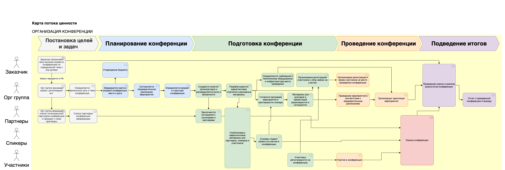

# Описание требований и архитектуры

## Введение
<!-- Общее краткое описание создаваемой системы -->
В рамках курса осуществляется проектирование решения на основе [постановки задачи от "заказчика"](../../task.md).

- [Описание требований и архитектуры](#описание-требований-и-архитектуры)
  - [Введение](#введение)
  - [Заинтересованные стороны](#заинтересованные-стороны)
  - [Бизнес-контекст (бизнес-требования)](#бизнес-контекст-бизнес-требования)
    - [Предпосылки (текущее состояние)](#предпосылки-текущее-состояние)
    - [Цели и задачи проведения конференции](#цели-и-задачи-проведения-конференции)
      - [Бизнес-цели и результаты](#бизнес-цели-и-результаты)
      - [Целевое состояние](#целевое-состояние)
        - [Карта потока ценности](#карта-потока-ценности)
      - [Сроки реализации](#сроки-реализации)
    - [Область применения и границы](#область-применения-и-границы)
      - [Область применения](#область-применения)
      - [Ограничения и допущения (опционально)](#ограничения-и-допущения-опционально)
  - [Глоссарий предметной области](#глоссарий-предметной-области)
  - [Модель предметной области](#модель-предметной-области)
  - [Контекстная диаграмма](#контекстная-диаграмма)
  - [Требования к системе](#требования-к-системе)
    - [Сценарии использования (Use case)](#сценарии-использования-use-case)
    - [Функциональные требования](#функциональные-требования)
    - [Нефункциональные требования/Требования к атрибутам качества](#нефункциональные-требованиятребования-к-атрибутам-качества)
    - [Ограничения](#ограничения)
  - [Архитектура](#архитектура)
    - [Журнал архитектурных решений](#журнал-архитектурных-решений)
    - [Контекст решения](#контекст-решения)
    - [Компонентная архитектура](#компонентная-архитектура)
    - [Реализация сценариев использования](#реализация-сценариев-использования)
    - [Программные интерфейсы](#программные-интерфейсы)
    - [Схема развертывания](#схема-развертывания)
  
## Заинтересованные стороны
<!-- Перечень заинтересованных сторон и их интересов по отношению к создаваемой системе. 
Подробнее: https://confluence.mts.ru/pages/viewpage.action?pageId=399975538 
-->
| Заинтересованная сторона | Интересы           | Интерес  |  Влияние  |
|:-------------------------|:-------------------|:---------|:----------|
| Заказчик конференции     | успешнаяорганизация конференции, репутация,прибыль |     высокий     |     высокое      |
| Спонсор конференции     | продвижение бренда и своих продуктов, привлечение ценных специалистов |     средний     |     высокое      |
| Партнеры конференции  (platinum group)   | привлечение клиентов, расширение аудитории |     средний     |     среднее     |
| Партнеры конференции  (gold group)   | привлечение клиентов, расширение аудитории |     средний     |     среднее     |
| Партнеры конференции  (silver group)   | привлечение клиентов, расширение аудитории |     средний     |     среднее     |
| Орг команда конференции (Ответственный организатор) | репутация, опыт, продвижение по карьерной лестнице |     высокий     |     среднее      |
| Орг команда конференции (Команда HR) | репутация, опыт, продвижение по карьерной лестнице |     высокий     |     среднее      |
| Орг команда конференции (Команда маркетинга) | репутация, опыт, продвижение по карьерной лестнице |     высокий     |     среднее      |
| Спикеры конференции  (ведущий доклада) | поделиться экспертизой,  формирование личного бренда |     средний     |      низкое     |
| Спикеры конференции  (ведущий воркшопа) | поделиться экспертизой,  формирование личного бренда |     средний     |      низкое    |
| Посетители конференции  (он-лайн участник) | новые знания, нетворкинг, опыт |     низкий     |      низкое     |
| Посетители конференции  (оф-лайн участник)  | новые знания, нетворкинг, опыт |     низкий     |      низкое     |

## Бизнес-контекст (бизнес-требования)
<!-- Общее описание бизнес-контекста создаваемой системы (автоматизируемой деятельности), список бизнес-целей заинтересованных сторон 
Подробнее: https://confluence.mts.ru/pages/viewpage.action?pageId=399973845
-->
### Предпосылки (текущее состояние)
ИТ-Компания, выросшая в два раза за последний год, нарастила сильную экспертизу в ит-разработке, но на данный момент эта информация никак не выведена на рынок, маркетинга нет и компания испытвает сложности в парнерствах с точки зрения репутации и опыта в ИТ и дальнейшем найме.
### Цели и задачи проведения конференции
Цели проведения конференции, обозначенные заказчиком мероприятия:
- Продвижение ит-бренда компании
- Нетворкинг с посетителями, формирование базы для дальнейшего найма
#### Бизнес-цели и результаты
- Сформировать процесс проведения конференций в компании: провести не менее 1 ИТ-конференциив текущем году с подготовкой процесса и приложенгия для последующих мероприятий 
- Обеспечить конференцию с общим количеством участников >3000 (1000 оф-лайн и 2000 онлайн)
- Повышение узнаваемости бренда brand awareness ит-специалистами с 20% до 50% через промо конференции, эффективные организацию и проведение мероприятия
- Увеличение количества кандидатов на позиции в компании на 1000 имен (30%  от ожидаемого количества участников) через выявление потенциальных кандиатов среди спикеров, активных участников и т.д.

#### Целевое состояние
Проведена ИТ-конференция, повышающая узнаваемость ит-компании и улучшающая репутацию. Разработан процесс и приложение для проведения конференций в будущем.
Процесс должен включать в себя слудющее (Приложение должно автоматизировать все пункты перечисленные ниже):
- работать с данными конференции: общие данные, расписание, секции, сессии,  помещения и т.д.)
- вести участников конференции разных ролей (заказчик, организатор, партнер, администратор, модератор, спикер, волонтеры, посетитель и т.д.) 
- формировать план и контент конференции, включая рецензирование докладов, согласовние списка спикеров и т.д.
Детальное описание целевого процесса приведено в карте потока ценности
##### Карта потока ценности

#### Сроки реализации
- 1 квартал
### Область применения и границы
#### Область применения
- ИТ-конференции проводимые компанией, данный сервис не планируется для внешних продаж
#### Ограничения и допущения (опционально)
- ожидается большой поток заявок на участие

## Глоссарий предметной области
<!-- Содержит основные понятия и термины предметной области  
Подробнее: https://confluence.mts.ru/pages/viewpage.action?pageId=375782595
-->
| Понятие                        | Сокращение                         | Определение                       |
|:-------------------------------|:-----------------------------------|:----------------------------------|
| Конференция | HelloConf | ИТ-конференция компании: организованное мероприятие, на котором участники собираются для обмена идеями, знаниями и опытом в ИТ  |
| Спонсор конференции | Спонсор  | Владелец бюджета конференции внутри компании  |
| Партнер конференции | Партнер  | Компания или организация, предоставляющая финансовую или иную поддержку конференции в обмен на рекламу или другие льготы  |
| График конференции  | График, роадмап | План работ по подготовке, запуску и проведению конференции с отчетными датами и вехами |
| Программа конференции | Программа | Составленный список мероприятий и мероприятий, запланированных на конференции, включая выступления, панельные дискуссии, семинары, и другие активности |
| Секция конференции | Секция, поток | Группа выступлений одной тематике
| Доклад конференции | Доклад, презентация | Представление или доклад, проводимый одним или несколькими спикерами перед аудиторией на конференции. Выступление,  предполагающее минимальное взаимодействие спикера с учатниками в зале |
| Воркшоп конференции  | Воркшоп, мастер-класс | Выступление,  предполагающее высокий уровень взаимодействия спикера с учатниками в зале |
| Панельная дискуссия | Круглый стол | Организованное обсуждение определенной темы с участием нескольких спикеров, модератора и аудитории  |
| Спикер конференции | Спикер, докладчик | Люди, которые выступают на конференции: эксперты, исследователи, ученые или бизнес-лидеры|
| Участник конференции | Участник | Лицо, зарегистрированное для участия в конференции и присутствующее на мероприятиии, может участвовать он-лайн или оф-лайн |
| Орг группа конференции | Организаторы | Группа, отвечающая за организацию конференции |
| Конференц-зал | Зал | Помещение, выделенное для проведения доклада, воркшопа или панельной дискусиии |
| Регистрация | Регистрация | Процесс, по которому участники регистрируются на конференцию. Она может быть онлайн или оффлайн, и включает в себя заполнение анкеты, оплату регистрационного взноса и получение бейджа |
| Согласование докладов | Согласование, рецензирование | Процесс согласования докладов конференции |
| Трансляция конференции | Трансляция | Трансляция конференции он-лайн участникам |

## Модель предметной области 

 Детальнее по ссылке [Модель предметной области](data/data.md)

## Контекстная диаграмма

Детальнее по ссылке [Модель контекстной диаграммы](context/context.md)

## Требования к системе

### Сценарии использования (Use case)
<!-- Подробное описание сценариев использования системы с привязкой к ролям участников и задействованным бизнес-сущностям 
https://confluence.mts.ru/pages/viewpage.action?pageId=375782108 
https://confluence.mts.ru/pages/viewpage.action?pageId=375782119 
-->
#### Диаграмма сценариев использования (Use Case Diagram) <!-- omit in toc -->

#### Список сценариев использования <!-- omit in toc -->

| ID     | Описание                                          |
|--------|---------------------------------------------------|
| UC.11 | *[Заполнить данные конференции](uc/uc11.md)* |
| UC.12 | *[Создать потоки конференции](uc/uc12.md)* |
| UC.13 | *[Оформить расписание сессий конференции](uc/uc13.md)* |
| UC.14 | *[Проверить материалы доклада спикера](uc/uc14.md)* |
| UC.15 | *[Допустить спикера к выступлению](uc/uc15.md)* |
| UC.16 | *[Получить отзывы по конференции](uc/uc16.md)* |
| UC.17 | *[Работа с трансляцией конференции]* |
| UC.21 | *[Регистрация участника]* |
| UC.22 | *[Оплата участия]* |
| UC.23 | *[Просмотр конференции]* |
| UC.24 | *[Оценить доклад]* |
| UC.31 | *[Подать заявку на участие в конференциия]* |
| UC.32 | *[Получить ревью материалов]* |
| UC.33 | *[Получить апрув на выступление]* |
| UC.34 | *[Получить отзывы на выступление]* |

### Функциональные требования
<!-- Описание требований к функциям, реализуемым системой. Требование может быть привязано к сценарию использования или быть общим 
Подробнее: https://confluence.mts.ru/pages/viewpage.action?pageId=375782501 
-->
| ID     | Функциональное требование             |
|--------|---------------------------------------|
| FR.11 | Система должна позволять вносить, редактировать и удалять данные о конференции: тема, описание, владелец и т.д. согласно модели данных |
| FR.12 | Система должна позволять вносить, редактировать и удалять потоки конференции со всеми данными согласно объектной модели |
| FR.13 | Система должна позволять вносить, редактировать и удалять сессии в потоках конференции со всеми данными согласно объектной модели |
| FR.14 | Система должна позволять сотруднику с правами проверяющего рецензировать материалы доклада, выставлять запланированному докладу признак "проверено" |
| FR.15 | Система должна позволять сотруднику с правами выставлять запланированному докладу признак "допущено к выступлению на конференции" |
| FR.16 | Система должна позволять сотруднику с правами получить сводный отчет по всем отзывам о докладах и качестве конференции |
| FR.17 | Система должна позволять запускать и останавливать трансляцию конференции |
| FR.21 | Система должна позволять участникам регистрироваться на конференцию |
| FR.22 | Система должна позволять оплачивать регистрацию |
| FR.23 | Система должна позволять просматривать трансляцию конференции |
| FR.24 | Система должна позволять оценить доклад |
| FR.31 | Система должна позволять подать заявку на участие в конференции |
| FR.32 | Система должна позволять спикеру видеть статус проверки матриеалов и комментарии к ним |
| FR.33 | Система должна позволять спикер видеть статус допуска к выступлению |
| FR.34 | Система должна позволять спикеру видеть отзывы по своему докладу |

### Нефункциональные требования/Требования к атрибутам качества
<!-- Требования к основным архитектурным характеристикам (атрибутам качества) системы - надежность, масштабируемость, ИБ, и др.
Подробнее: https://confluence.mts.ru/pages/viewpage.action?pageId=375782530
-->
| ID     | Атрибут качества             | Описание требования                       |
|--------|------------------------------|-------------------------------------------|
| QR.01 | Масштабируемость | Проектирование системы должно учитывать дальнейшее масштабирование конференций не несколько стран с количеством участников более 10000 |
| QR.02 | Производительность | Одновременный просмотр конференции должен быть доступен 10000 участникам |
| QR.03 | Производительность | Количество запросов на регистрацию может быть 100 запросов в секунду в пике  |
| QR.04 | Производительность | Количество запросов на подачу доклада с материалами может быть 100 запросов в секунду в пике |
| QR.05 | Надежность | Система должна хранить резервную копию всех данных за исключением отзывов  |
| QR.06 | Доступность | Доступность приложения конференции, включая трансляции, должна быть не ниже 99.9% |
| QR.07 | Безопасность | Все пользователи системы должны быть авторизованы и аутентифицированы для работы с системой |
| QR.08 | Usability |  Система должна иметь возможность работы для слабовидящих |

### Ограничения
<!-- Описываются ограничения, оказывающие влияние на архитектуру системы - временные, финансовые, технологические
Подробнее: https://confluence.mts.ru/pages/viewpage.action?pageId=375782592
-->
| ID     | Ограничение            |
|--------|------------------------|
| AC.01 | Приложение должно поддерживать ios и android ос |
| AC.02 | Приложение должно поддерживаться в браузерах chrome, safari |
| AC.03 | Приложение должно полностью соблюдать законодательство РФ, включая работу с персональными данными |

## Архитектура

### Журнал архитектурных решений
<!-- Записи о ключевых принятых архитектурных решениях (ADR) для реализации архитектурно-значимых требований.
Подробнее: https://confluence.mts.ru/pages/viewpage.action?pageId=421162308
-->
- [ADR.001 Выбор типа системы ACID, BASE](adr/adr001.md)
- [ADR.002 Уточнение выбора типа системы на основе CAP: P (A/C)](adr/adr002.md)
- [ADR.003 Выбор метода интеграции](adr/adr003.md)
- [ADR.004 Выбор структуры интеграции](adr/adr004.md)
- [ADR.005 Выбор интеграционного протокола взаимодействия](adr/adr005.md)

### [Контекст решения](context/context.md)

### [Компонентная архитектура](components/components.md)

### Реализация сценариев использования
<!-- Реализация сценариев использования на основе взаимодействия компонентов системы и внешних систем/участников.
Диаграммы последовательности (UML Sequence diagram) и текстовое описание.

Подробнее: 
https://confluence.mts.ru/pages/viewpage.action?pageId=399442132
https://confluence.mts.ru/pages/viewpage.action?pageId=399442170
-->
| ID     | Описание                          | Реализация                                    |
|--------|-----------------------------------|-----------------------------------------------|
| UC.001 | *Название сценария использования* | [Реализация сценария](uc-impl/uc.001-impl.md) |

### Программные интерфейсы
<!-- Спецификации публичных API системы и ее компонентов (синхронных, событийных). Создается на основе модели предметной области для реализации сценариев использования. 
  Форматы: OAS/Swagger, GraphQL, AsyncAPI/CloudEvents
-->
| Компонент             | Интерфейс                                      |
|:----------------------|:-----------------------------------------------|
| *Название компонента* | *[Название интерфейса](api/service-name.yaml)* |

### [Схема развертывания](deployment/deployment.md)
